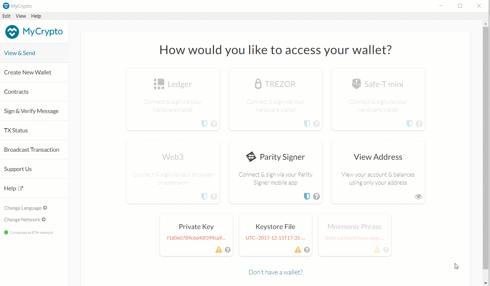

# Building the Blockchain

### <b> Background </b>
The blockchain domain is rapidly changing.  Even those in a highly technical role must stay abreast of what is happening in the digital finance landscape as many FinTech companies are using and creating tools and services that are powered by blockchain. As a FinTech professional in these changing times, it's important to not only be aware of the advancements happening within the FinTech blockchain space, but to also understand the process for developing your very own blockchain.

In this exercise, I have created a two-part series. Series 1 contains a case study on a Canadian FinTech company "Wealthsimple" and in the Series 2, I have developed my very own blockchain.

### <b> Summary </b>

I have accomplished the following main tasks:

1. Case Study - I have analyzed how one of the Top 10 most popular Canadian financial technology company called "Wealthsimple Inc.", which primarily specializes in online investment management services is now using blockchain technology to solve a standing financial problem in Canada. I have researched the domain and written a detailed case study of the company.

2. I have set up a testnet blockchain for my organization and completed the following tasks.
* Set up your custom testnet blockchain.
* Sent a test transaction
* Created a repository
* Wrote instructions on how to use the chain for the rest of my team

### <b> Files locations in Github </b>

1. I have created a repository called `Building-Blockchain` in the Github.

2. Inside the above there are two sub-folders named "Blockchain Case Study" and "POA Development Chain" which has all the solution files

### <b> Details on each tasks </b>

### <b> 1. Blockchain Case Study </b> 

I have created a case study that analyzes how "Wealthsimple Inc.", a Canadian FinTech blockchain company is using technology to solve a standing financial problem in Canada.

#### <b> What Is It </b> 

Wealthsimple Inc. is a Toronto-based FinTech company which was founded 6 years ago in September 2014. Founders Michael Katchen, Rudy Adler and Brett Huneycutt founded a business that would revolutionize wealth management for their friends and other millennials. Traditional investment companies typically target a demographic of people aged 45 and above, but Weathsimple’s current CEO, Michael Katchen, wants to bring people into the world of investment earlier. His philosophy is as follows:
   
<i> “Millennials are missing out on opportunities to secure their financial future,” he explained. “A lot of young people are mistrustful of big banks and put off by the paperwork. We are combining financial expertise with smart IT to shake up the industry and modernise investment.” </i>

The average age of Wealthsimple's customer was between 30 to 35 years with university degree when it started out. But today, Wealthsimple caters to the uninitiated millennial investor, with a reported 80% of its clients under the age of 45, and 40% of them being first-time investors, many trade or want to trade in crypto. According to the CEO, the biggest challenge in the Canadian market is non-availability of safe, secure and credible platforms for cryptocurrency trading. 

On the 14 July 2020, Wealthsimple launched a cryptocurrency trading platform in a move to attract new customers to its brand and capitalize on renewed interest in the lightly regulated asset class popular with young investors. The platform, will allow its clients to trade in two of the highest market cap cryptocurrencies- bitcoin and ethereum using a Wealthsimple Trade app (<i>Deposits and withdrawals can only be made in Canadian dollars</i>). This is offered by Wealthsimple Digital Assets Inc. (WDA), a virtual currency dealer money services business authorized by FINTRAC. Cryptocurrencies can only be held in a non-registered account with Wealthsimple Crypto.

On August 7, 2020, the Canadian Securities Administrators (CSA) has granted WDA time-limited relief from certain requirements to allow it to trade crypto assets and operate a platform that facilitates the buying, selling and holding of crypto assets in all Canadian jurisdictions other than Quebec which has issued separate exemptive relief. Trading will be restricted to Bitcoin and Ethereum and is limited to a maximum of $30,000 per client over a 12-month period. Gemini Trust Company (<i> one of the most trusted names in crypto, with the highest U.S. government security rating and  $200M in cold storage insurance</i>), LLC will serve as a licensed third-party custodian while multiple crypto asset trading firms will act as liquidity providers for the purchase and sale of crypto assets. This has made Wealthsimple, Canada’s first crypto asset platform authorized through the CSA Regulatory Sandbox initiative. In Québec, WDA is registered as a derivatives dealer.

While Wealthsimple is looking to brand its product as a safer alternative to other crypto exchanges, it will still operate in a hazy regulatory environment. Wealthsimple Crypto is currently not registered as a securities adviser or securities dealer. Crypto-assets purchased and held in an account with Wealthsimple Crypto are not protected by the Canadian Investor Protection Fund (CIPF), the Canadian Deposit Insurance Corporation or any other investor protection insurance scheme.

#### <b> Why This Matters </b> 

Blockchain together with Bitcoin and Cryptocurrency is by far one of the most disruptive and revolutionary technologies of our time. As of 2019 global spending on Blockchain solutions has been over $2.7 billion which is likley to increase by almost 500% by 2023. This has led to every industry wanting to adopt blockchain technology and reap its benefits. 

Although WDA is under a time-limited exemptive relief by the CSA, it is Canada’s first crypto asset platform authorized through the CSA Regulatory Sandbox initiative. The decision is a win-win for consumers, fintech companies and the regulators. 
1. Regulators - Not only does this highlight the limitations of the current Canadian regulatory environment to tackle rise of Blockchain but offers a bridge to emerging custodial and trading solutions for crypto asset trading that are rapidly developing outside of Canada. This will provides regulators the ability to monitor and analyze anonymized trade data to proactively build out data-driven regulatory options framework for trading crypto assets”.
2. Consumers - They would not be charged commission on trades, have opportunities to learn and become smarter investors and above all, regulator are ensuring that the fintech companies offering these services have internal controls to ensure fraud, money laundering, and insolvency risks are mitigated. Regulators would monitor the practices of counterparties and service providers, such as custodians and crypto trading firms, to ensuring investor protection and fair and reasonable pricing.
3. Fintech Companies - To attract more customers, increase revenues and opportunity to be market leaders in adopting new technologies.

#### <b> Why This May be Interesting </b> 

In Canada, Wealthsimple is the biggest player in the "digital space" at 70% market share but they continue capturing market share through new products and services. They have registered three new businesses in 2019 namely Wealthsimple Cash in June 2019, Wealthsimple Payments in August, and Wealthsimple Digital Assets, issued in October 2019. 

On 14 October 2020, they have achieved Unicorn status on a CA$114 million investment round led by by TCV, along with Greylock, Meritech, Two Sigma Ventures and existing investor Allianz X. 

They have many advantages over their competitors as they have unique product offerings, such as its diverse lineup of portfolio choices (including socially responsible and halal-compliant options) and unfettered access to a team of financial advisors for all clients, regardless of account balance. It is also ideal for novice investors or those who are uneasy choosing their own investments since it recommends a portfolio of low-fee investments or individualized portfolio for large accounts which are explained below. Additionally, Wealthsimple is great for planning towards bigger money goals and investing/saving in tax-free accounts – retirement (RRSP), home down payment and wedding (TFSA), kids college education (RESP).

Wealthsimple has been pioneer fintech company in online investment in Canada, have world-class financial experts and best technology talents. Given these factors, it will be interesting to watch the interplay between adoption of blockchain and regulatory space through them. This will set precedence for competitors and industry including banks which faces huge burden of regulatory complaince.

### <b> 2. Proof of Authority Development Chain </b>

The Proof of Authority (PoA) algorithm is typically used for private blockchain networks as it requires pre-approval of, or voting in of, the account addresses that can approve transactions (seal blocks).

I have set up a testnet blockchain for my organization "ZBank", a small, innovative bank that is interested in exploring what blockchain technology can do for them and their customers. The private testnet can be used by I and my team of developers to explore potentials for blockchain at ZBank. This was decided because there is no real money involved, which will give us the freedom to experiment. Testnets allows for offline development.

### Instructions

### Setup the custom out-of-the-box blockchain

#### 1. Creation of pre-approved sealer address

Because the accounts must be approved, generate two new nodes with new account addresses that will serve as our pre-approved sealer addresses.
This will be with a separate datadir for each using geth.

* Open a terminal window, navigate to the `Blockchain-Tools` folder and typed the following command:     
        
        ./geth --datadir node1 account new 
        ./geth --datadir node2 account new

* Note the Public address of the key and Path of the secret key file for each of the node's addresses.

#### 2. Generation of the genesis block

* Run puppeth, name your network, and select the option to configure a new genesis block
 
        ./puppeth

* Type in a name for your network, like "zbank1" and hit enter to move forward in the wizard
* Type `2` to pick the `Configure new genesis` option, then `1` to `Create new genesis from scratch`
* Now you have the option to pick a consensus engine (algorithm) to use. Type `2` to choose `Clique (Proof of Authority)` and continue

* You will be asked to enter accounts to be sealed. Paste both account addresses from the first step one at a time into the list of accounts to sealed

* You will then be asked to enter accounts to be pre-funded. Paste account addresses as prior steps. There are no block rewards in PoA, so you'll need to pre-fund.

* Then you can choose no for pre-funding the pre-compiled accounts (0x1 .. 0xff) with wei. This keeps the genesis cleaner.

* Then type in a name for your chain/ network ID if you want. However, this is optional
* Complete the rest of the prompts, and when you are back at the main menu, choose the "Manage existing genesis" option.

* Then select option '2' for exporting genesis configurations. This will fail to create two of the files, but you only need networkname.json.

#### 3. Initialization of the nodes to use your genesis block

With the genesis block creation completed, we will now initialize the nodes with the genesis' json file.

* Using geth, initialize each node with the new networkname.json, replacing `yournetworkname.json` with your own:

        ./geth --datadir node1 init networkname.json
        ./geth --datadir node2 init networkname.json

You should see this success message:

#### 4. Usage of nodes for mining blocks

Now the nodes can be used to begin mining blocks.

* Open a seperate terminal windows, run the first node, unlock the account, enable mining, and the RPC flag. Only one node needs RPC enabled.

        ./geth --datadir node1 --unlock "SEALER_ONE_ADDRESS" --mine --rpc --allow-insecure-unlock

 <b> NOTE: Type your password and hit enter - even if you can't see it visually! </b>

You should see this success message:

* Open a seperate terminal windows, set a different peer port for the second node and use the first node's `enode` address as the `bootnode` flag. Type the following command:

        ./geth --datadir node2 --unlock "SEALER_TWO_ADDRESS" --mine --port 30304 --bootnodes "enode://SEALER_ONE_ENODE_ADDRESS@127.0.0.1:30303" --ipcdisable --allow-insecure-unlock

 <b> NOTE: Type your password and hit enter - even if you can't see it visually! </b>. Be sure to unlock the account and enable mining on the second node!
You should see this success message:

* Your private PoA blockchain should now be running!

#### 5. Blockchain addition to MyCrypto for testing

With both nodes up and running, the blockchain can be added to MyCrypto for testing by following below steps:

* Open the MyCrypto app, then click Change Network at the bottom left

* Click "Add Custom Node", then add the custom network information that you set in the genesis.
* Make sure that you scroll down to choose Custom in the "Network" column to reveal more options like Chain ID
* Type ETH in the Currency box
* In the Chain ID box, type the chain id you generated during genesis creation 
* In the URL box type: http://127.0.0.1:8545.  This points to the default RPC port on your local machine
* Finally, click Save & Use Custom Node

#### 6. Sending transaction between accounts

After connecting to the custom network in MyCrypto, it can be tested by sending money between accounts.

* Select the 'View & Send' option from the left menu pane, then click 'Keystore file'.

* On the next screen, click Select Wallet File, then navigate to the keystore directory inside your Node1 directory, select the file located there, provide your password when prompted and then click Unlock.
* This will open your account wallet inside MyCrypto.
* This is the balance that was pre-funded for this account in the genesis configuration; however, these ETH tokens are just for testing purposes.

* Send a transaction from the `node1` account to the `node2` account. In the To Address box, type the account address from Node2, then fill in an arbitrary amount of ETH

* Confirm the transaction by clicking "Send Transaction", and the "Send" button in the pop-up window.

* Click the Check TX Status when the green message pops up, confirm the logout

* You should see the transaction go from Pending to Successful in around the same blocktime you set in the genesis

* You can click the Check TX Status button to update the status.

* Celebrate, you just created a blockchain and sent a transaction!

#### Hints

* If you get stuck - try our step by step PoA Guide located [here](Resources/POA-Blockchain-guide.md).

* If you aren't seeing any movement in the wallet amounts in MyCrypto after sending/receiving transactions, try the following:

    * Terminate both nodes using control+C in the Node1 and Node2 terminal windows.
    * Change networks in MyCrypto to a Testnet such as Kovan.
    * Restart Node1 and Node2 in their terminal windows.
    * Reconnect to your network in MyCrypto.
    * Log into your wallet and refresh the amount.

* If that doesn't help make sure you are sending a large enough sum of ETH to see actual movement in the digits. You may have to click on the amount itself to see the full value down to the WEI.

### Resources

Below sources were used to conclude the above case study. It has list all websites, podcasts, blogs, or articles that were consulted in order to write the report, and provide links.
* [The Company's Website](https://www.wealthsimple.com/en-ca/)
* [Company's information on wikipedia](https://en.wikipedia.org/wiki/Wealthsimple)
* [Crypto info on Company's Website](https://www.wealthsimple.com/en-ca/product/crypto)
* [Blockchain info on Company's Website](https://www.wealthsimple.com/en-ca/learn/what-is-blockchain)
* [The Company's Magazine](https://www.wealthsimple.com/en-ca/magazine/crypto)
* [The Company's Advertisements](https://www.youtube.com/watch?v=fypQIkUKgUE#action=share)
* [Globe and Mail Report on launch of Wealthsimple cryptocurrency trading platform](https://www.theglobeandmail.com/business/article-wealthsimple-launches-cryptocurrency-trading-platform/)
* [Wealthsimple Digital Assets Inc. Becomes Canada’s First Registered Crypto Asset Platform](https://www.stikeman.com/en-ca/kh/canadian-securities-law/wealthsimple-digital-assets-inc-becomes-canadas-first-registered-crypto-asset-platform?utm_source=Mondaq&utm_medium=syndication&utm_campaign=LinkedIn-integration)
* [Wealthsimple achieves $1.5 billion valuation on new fundraising round](https://www.finextra.com/newsarticle/36757/wealthsimple-achieves-15-billion-valuation-on-new-fundraising-round?utm_medium=rssfinextra&utm_source=finextrafeed)
* [Statistics Canada](https://www.statista.com/statistics/444868/canada-resident-population-by-age-group/)
* [Canadian Encyclopedia](https://www.thecanadianencyclopedia.ca/en/article/millennials-in-canada)
* [Nerdwallet 2020 Review](https://www.nerdwallet.com/reviews/investing/advisors/wealthsimple)
* [FinTech blogs and/or podcasts[1]](https://betakit.com/wealthsimple-raises-100-million-from-allianz-x-to-build-a-full-stack-financial-service/#:~:text=Wealthsimple%20raises%20%24100%20million%20led,full%20stack%20financial%20service%20%7C%20BetaKit)
* [FinTech blogs and/or podcasts[2]](https://betakit.com/wealthsimple-registers-three-businesses-indicating-expansion-into-new-financial-services/)
* [FinTech blogs and/or podcasts[3]](https://betakit.com/wealthsimple-to-spin-out-advisory-service-into-separate-company/)
* [FinTech blogs and/or podcasts[4]](https://betakit.com/wealthsimple-registers-three-businesses-indicating-expansion-into-new-financial-services/)
* [FinTech blogs and/or podcasts[5]](https://betakit.com/wealthsimple-raises-100-million-from-allianz-x-to-build-a-full-stack-financial-service/#:~:text=Wealthsimple%20raises%20%24100%20million%20led,full%20stack%20financial%20service%20%7C%20BetaKit)
* [FinTech blogs and/or podcasts[6]](https://betakit.com/digital-finance-institute-names-canadas-top-50-fintech-companies-for-2019/)
* [The Canadian Fintech Ecosystem Map](https://ecosystem.formfintech.com/)
* [The 2019 Canadian fintech market map](https://www.pwc.com/ca/en/industries/technology/canadian-fintech-market-map.html)
* [Introducing The FinTech Landscape In Canada](http://www.industryandbusiness.ca/development-and-innovation/introducing-the-fintech-landscape-in-canada)
* [Canadian Fintech Industry Set to Witness Strong Grow: Report](https://fintechnews.ch/fintech/fintech-canada-report/19783/)

